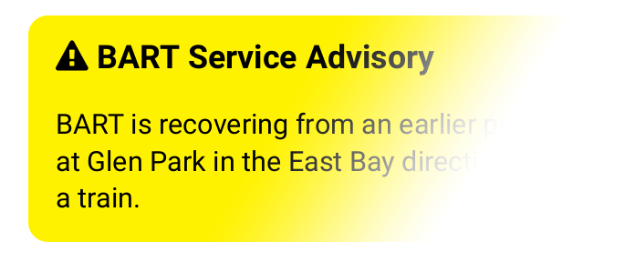

# BART Departures
[](http://hits.dwyl.com/jimeelicious/bartdepartures)  BART Departures is an easily deployable, mobile-ready, Python-based program running on 
a web server that displays [BART](bart.gov) train departure times at any given station. This program was designed to resemble a hybrid of an actual departure signboard and the 511.org application.
### Why?
Why not? BART's official app takes a while to load, and it's better to pull of a web page yourself. The advantage of a web app is that many computers have web browsers, which increases the accessibility for many people. This 
project was originally designed for me to improve my Python abilities, but also to learn about BeautifulSoup. Feel free to edit the code yourself to fit your needs.
# **Features**
### *Accessibility*
   - Access from any web-browser
   - Bookmarkable links for stations
### *Real time service alerts*
    Advisories are prominently displayed on the top to warn of any possible service delays or cancelations. Each advisory is displayed as a separate entry.
### *Autoupdate*
- Data is pulled every 45 seconds from the official [BART API](https://api.bart.gov).
### *Removal of Duplicates*
- Cleans up duplicate train times from the API - Better depicts an actual signboard vs. the official BART app.
   
### *Easily customizable*

```
# Set API key
apikey = "MW9S-E7SL-26DU-VV8V"
# Default station at home page (station abbreviation)
defaultstation = "12th"
# Show service advisories when present
advisory = "yes"
# Refreshes the board every 45 seconds
autoref = "no" 
``` 
The default landing page can be set to fit your needs
  
# **Live example**
Click [here](https://live.homelab.app) to view a working example of the program running. 
# **How To** Features
### Autorefresh
The page is designed to automatically refresh if set in the *bart.py* code. Its setting can be overriden by attaching the variable `autorefresh` to `yes` or `no`. In other words, attach `?autorefresh=yes` to the end of the URL to 
force the page to autorefresh, such as `example.com/?autorefresh=yes`. If the variable is not the first in the URL, replace the `?` with a `&`, such as `example.com/?station=sfia&autorefresh=yes`.
### Manual station selection
In the code, there is a section that enables you to select a different station on the HTML page. Or you can simply add `station` variable in the URL followed by the 4-alphanumberic station code. A full list of the BART station 
codes are available [here](http://api.bart.gov/docs/overview/abbrev.aspx). Example: `example.com/?station=EMBR` or `example.com/?autorefresh=yes&station=24th`
### Defaults
You can set the main homepage to default to your desired settings mentioned above in the code itself. Edit variables in the *bart.py* code to set your defaults.
